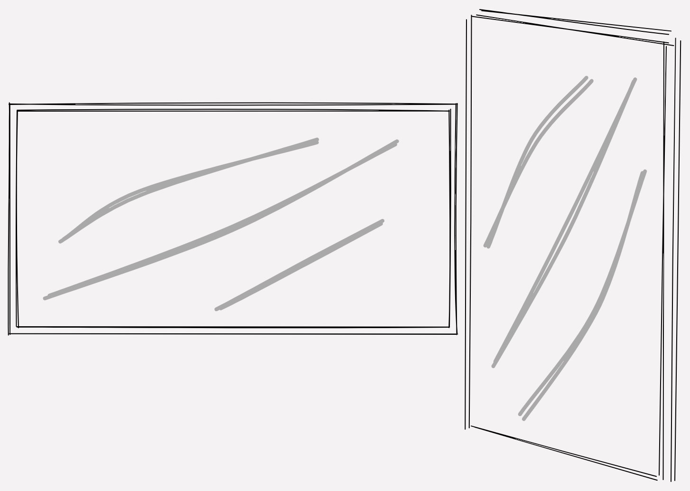

# Using a secondary monitor in portrait mode

Have you ever considered using your secondary monitor in portrait mode?
If you never tried it, let this be your sign to give it a shot.

I have been using this setup recently and I feel that it has boosted my
productivity by a lot.
Whether it is just because of a change in environment or it has an actual
benefit to use your monitors like this, is probably not really set in stone.
I guess everyone has a strong subjective feeling on how the working space should
be set up and how it works best for that individual being.
But, I like to experiment and switch things around frequently, so here is
what I found out.

## Pros of having a Vertical Monitor

After fiddling around with exact position and height I got massively improvements
in the following areas.
Reading documents in a paper like format on screen is feeling way more
intuitive while laid back on my chair and sipping coffee.
Basically, anything that is long or needs you to scroll a lot on the classical
widescreen, feels better. Slack chats, Discord, Blogs, Articles, oh - Pull Requests!

For gods sake, I hope you don't have to review those mile long pull requests
very often. But even small Pull Requests are way easier to read. And if one of
your colleagues is pushing out that nightmare of a long pull request and you
don't feel like declining it immediately, it is way easier to read on a vertical
screen - at least from my point of view.

So, I actually rarely code on that screen, but if I do it is most often
YAML code. Any infrastructure code, configurations or OpenAPI definitions in
YAML for example. Using swagger-ui on a vertical screen has a lot of benefits as well,
because of the nature of that page and how the documentation is structured.

## Cons of having a Vertical Monitor

Regarding some cons, well obviously, you lose some horizontal space for applications
in comparison to your normal secondary widescreen monitor. For me the gained vertical
space is a compromise I can easily live with.

Another thing is that you need to be able to place the bottom of the screen
directly on the table, otherwise you have to look up really high.
Before I had my monitor sitting right on the desk it caused some neck pain, from
looking up quite often to the upper edge of the screen.

Next up: Sometimes text at the very top or bottom of the screen is a bit hard
to read or focus on for longer times e.g. if you're not able to scroll for instance.
This is why I also like to use the upper and lower part of the screen only for
some status updates or state change notifications.
Window manager can help to organize the windows on the screen in a way, that
you can split up your onscreen space in three parts very fast.

# Conclusion

I like it and it seems like I will not change back very soon.

Let me know if you have any experience with this and if you
have cool tips or tools that help with having a monitor in portrait mode.
_I would love to hear them!_
